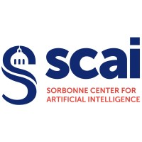

<h1>UE médecine à l'heure de l'IA et des "Omiques"</h1>

  

    
  

  

    
  

## Présentation de l'UE

L'évolution rapide des technologies numériques, couplée à une augmentation exponentielle du volume de données hétérogènes (Big Data), notamment dans le domaine de la santé, soulève un défi majeur. Il est devenu impératif de préparer les futurs professionnels de santé à maîtriser ces outils et à comprendre leurs enjeux. En effet, les technologies numériques, incluant l'intelligence artificielle (IA), s'apprêtent à révolutionner divers secteurs en médecine. 

## Pré-requis
- **(1) Création d'un compte google colab**

→ [Google colab](https://colab.research.google.com/).

→ [tutoriel à lire pour google gollab](https://www.marqo.ai/blog/getting-started-with-google-colab-a-beginners-guide)

- **(2) Création d'un compte GitHub**
→ [GitHub](https://docs.github.com/fr/get-started/start-your-journey/creating-an-account-on-github)

- **(3) Installation de Anaconda (pour votre ordinateur perso)**

→ [Anaconda](https://www.anaconda.com/download)

## Intervenants 

- Dr Guillaume Bachelot (AHU Biologie de la reproduction - CECOS, site Tenon, Sorbonne-Université)
  
- Dr Alexandre Godmer (AHU département de bactériologie, site hôpital Saint-Antoine, Sorbonne-Université, INSERM, U1135, Centre d’Immunologie et des Maladies Infectieuses, Cimi-Paris, Paris).
  
- Pr Antonin Lamazière

## Programme
# Programme UEIR IA et "-Omiques" – DFGSM2  
**Responsables : A. Lamazière, A. Godmer, G. Bachelot**  

| Matin 9h-12h | Après-midi 14h-17h |
|-------------|--------------------|
| **Paramétrage des comptes + Introduction IA ; Statistiques et méthodes non supervisées** (A. Lamazière / A. Godmer) | **14h - Présentation des 2 UE** (F. Dhombres / A. Lamazière, 1h) **14h30 - Introduction aux différents types d'IA** (F. Dhombres, 1h) **15h30 - Introduction au NGS** (T. Courtin, 1h) |
| **9h - Retour d’expérience sur le développement d’une IA en infertilité masculine**, comparaison des grandes approches de machine learning (G. Bachelot / A. Godmer, 1h) **10h - IA et OMICs** (A. Lamazière, 2h) | **Initiation à Python (partie 1 et partie 2)** (A. Lamazière / A. Godmer) |
| **9h - IA et Paludisme** : application à la télé-expertise, au diagnostic, et à la santé publique (C. Nabet, 1h) **10h - Intérêt du codage en recherche** : exemple de l’IA appliquée à la spectrométrie de masse (A. Godmer, 1h) **11h - IA appliquée à l’anatomopathologie des syndromes de Lynch et Lunch-like** (M. Svrék) | **Comprendre le Machine Learning avec Python** (A. Lamazière / A. Godmer) |
| **9h - IA et cas d’usage sur les données patient d’un entrepôt de données de santé (EDS)** (C. Gerardin) **10h - IA appliquée au diagnostic en cytologie hématologique** (F. Delhommeau, 1h) **11h - IA appliquée à la sénologie** (I. Thomassin – Zoom à confirmer) | **Initiation au Machine Learning sur un jeu de donnée médicale** (A. Lamazière / A. Godmer) |
| **9h - Matinée bibliographie "IA en médecine"** (F. Dhombres) Recherches bibliographiques (MeSH, PubMed), analyse d’article et types d’études, présentation du format attendu de la présentation de fin d’UE | Travail personnel |
| **9h - Retour d’expérience : développement de méthodes d’IA symbolique et numérique** pour l’aide à la décision en cancérologie (cancer du sein) (A. Redjal, 1h) **10h - IA hybride appliquée à l’échographie fœtale** (F. Dhombres) | **Présentation du Data Challenge + questions** (A. Lamazière / A. Godmer) |
| **9h - AI-assisted nephrogenomics** (L. Mesnard) **10h - Machine Learning en médecine : mises en situations** (A. Godmer, G. Bachelot) **11h - IA appliquée au traitement automatique des langues dans le domaine de la santé : principes et exemples** (X. Tannier, C. Gerardin) | Travail personnel |
| Travail personnel | Travail personnel |
| Travail personnel | **Évaluation** |
| **CONGRÈS Mini Congrès Rechercher clinique et IA – LCA – Présentation des DFGSM3 aux DFGSM2** | **CONGRÈS Mini Congrès Rechercher clinique et IA – LCA – Présentation des DFGSM3 aux DFGSM2** |

## Evaluation de l'UE :

- Réalisation d'un [Data Challenge](TP/6_TP_DataChallenge_MALDI_TOF_version_apprenant.pdf)
- Data Challenge à remplir : [ici](TP/6_TP_DataChallenge_MALDI_TOF_version_apprenant.ipynb)
- Présentation de vos résultats sous forme d'un power-point par groupe de 2 (3 diapos)

